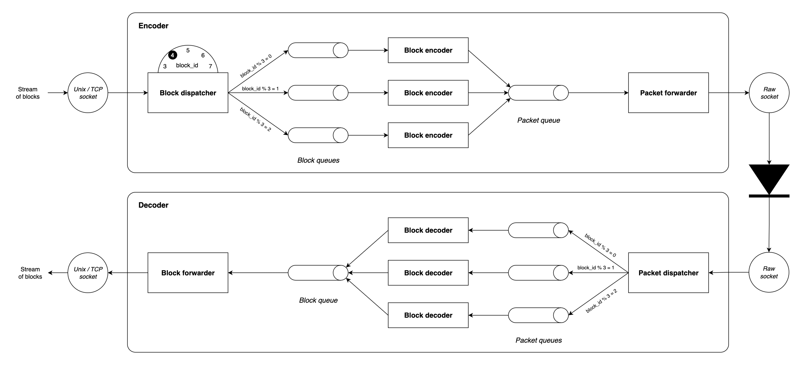

<div class="title-block" style="text-align: center;" align="center">

# Garuda codec


**[Overview](#overview) &nbsp;&nbsp;&bull;&nbsp;&nbsp;**
**[Getting started](#getting-started) &nbsp;&nbsp;&bull;&nbsp;&nbsp;**
**[Configuring network interfaces](#configuring-network-interfaces) &nbsp;&nbsp;&bull;&nbsp;&nbsp;**
**[Architecture](#architecture) &nbsp;&nbsp;&bull;&nbsp;&nbsp;**
**[Tests](#tests)**

</div>

## Overview

Garuda codec is an encoder-decoder for transferring data blocks of fixed-size over a [unidirectional network](
https://en.wikipedia.org/wiki/Unidirectional_network)
with [forward error correction](https://en.wikipedia.org/wiki/Error_correction_code).
It provides low-level primitives on which high-level data transfer systems can be built.

The codec provides robustness against packet loss by leveraging [RaptorQ](https://en.wikipedia.org/wiki/Raptor_code) for
error correction.

## Getting started

### Requirements

- Linux
- [rustup](https://rust-lang.org/tools/install/)
- [Mise](https://mise.jdx.dev/)

The dependencies can be installed with the following command.

```bash
mise install
```

### Build

The tool should always be built with the release profile to provide the best performance.

```bash
cargo build --release
```

### Usage

The encoder and the decoder operate as servers listening on an input data stream and writing to an output data stream.

For demonstration purposes, the encoder will read a data block from stdin, forward it to the decoder through a TCP
socket, and the decoder will write the received decoded data block to stdout.

Let's start by creating a source block to transfer.

```bash
dd if=/dev/zero bs=287232 count=1 > source.bin
```

Now, let's start the decoder.

```bash
target/release/garuda-codec decoder --input tcp://127.0.0.1:8081 --output - -w 3 > result.bin
```

⚠️`-w 3` specifies the number of worker threads to use, it should be identical between the encoder and the decoder.

Using another terminal instance, let's send an encoded source block using the encoder.

```bash
target/release/garuda-codec encoder --input - --output tcp://127.0.0.1:8081 -w 3 < source.bin
```

Finally, let's ensure that the sent and the received blocks are identical.

```bash
cmp source.bin result.bin
```

What we just did was encoding a block of data with RaptorQ, transferring it over TCP, and then decoding it back.

In practice, the data will not be transferred over a reliable channel like TCP but rather over an unreliable
unidirectional network. Such a network can be simulated using veth pairs. The following command will create a veth pair
that randomly loses a small percentage of packets.

```bash
sudo ./scripts/setup-veth.sh --device1 origdev --device2 destdev
```

When transferring data over unidirectional network, packets should be sent directly to the network interface
controller (NIC) using [raw packet sockets](https://man7.org/linux/man-pages/man7/packet.7.html).

Note that, to bind to a packet socket, a process needs to be granted the
[`CAP_NET_RAW` capability](https://man7.org/linux/man-pages/man7/capabilities.7.html).

```bash
sudo setcap cap_net_raw+ep ./target/release/garuda-codec
```

Then, the encoder and the decoder can be run using the `af_packet` input and output streams.

```bash
target/release/garuda-codec decoder --input af_packet://destdev --output - -w 3 > result2.bin
target/release/garuda-codec encoder --input - --output af_packet://origdev -w 3 < source.bin
```

With the above commands, we were able to reliably transfer a block of data over an unreliable unidirectional network.

The complete list of supported input and output streams can be obtained from
`target/release/garuda-codec encoder --help` and `target/release/garuda-codec decoder --help`.

### Transferring files

The Garuda codec CLI implements a simple file transfer system on top of the data block transfer feature. This is
not a production-ready solution but rather a proof-of-concept to demonstrate the capabilities of the codec.

The `receive` and `send` commands can be used to transfer files using the `decoder` and the `encoder`.

```bash
target/release/garuda-codec receive -d ./out -i tcp://127.0.0.1:8082
target/release/garuda-codec decoder --input tcp://127.0.0.1:8081 --output tcp://127.0.0.1:8082
target/release/garuda-codec encoder --input tcp://127.0.0.1:8080 --output tcp://127.0.0.1:8081
target/release/garuda-codec send -f /some/file/to/send -o tcp://127.0.0.1:8080
```

## Configuring network interfaces

Garuda codec requires that the network preserves the order of the packets sent. Moreover, no packets other than
those produced by the codec should transit over the network link. Let's configure the interfaces to respect these
constraints.

Set the number of RX and TX queues to 1 on the sending and receiving network interfaces.

```bash
sudo ethtool -L "$SENDING_DEVICE" rx 1 tx 1
sudo ethtool -L "$RECEIVING_DEVICE" rx 1 tx 1
```

To avoid any disturbance on the communication channel, IPv6 should be disabled for the interfaces because the
[Neighbor Discovery Protocol](https://en.wikipedia.org/wiki/Neighbor_Discovery_Protocol) results in ICMPv6 packets being
periodically sent over the network.

```bash
sudo sysctl -w net.ipv6.conf."$SENDING_DEVICE".disable_ipv6=1
sudo sysctl -w net.ipv6.conf."$RECEIVING_DEVICE".disable_ipv6=1
```

`qdisc` that can break ordering should be removed. Interfaces can be reset to their default `qdisc` with the following
commands.

```bash
sudo tc qdisc del dev "$SENDING_DEVICE" root
sudo tc qdisc del dev "$RECEIVING_DEVICE" root
```

Finally, it is recommended to throttle outgoing traffic to avoid overloading the decoding side of the network.

```bash
sudo tc qdisc add dev "$SENDING_DEVICE" root tbf rate 100mbit burst 32kbit latency 400ms
```

Such a `qdisc` can be used as it preserves the order of the packets.

## Architecture



## Tests

The tests require setting up a veth pair to simulate a unidirectional network. This can be automated by running the
following script.

```bash
sudo ./scripts/setup-veth.sh --device1 origdev --device2 destdev
```

Then, the tests should be run with the release profile.

```bash
cargo test --release
```

## Acknowledgements

This project is only possible because of the fantastic work of [@cberner](https://github.com/cberner) on
the [Rust implementation of RaptorQ](https://github.com/cberner/raptorq).

## License

Licensed under

- Apache License, Version 2.0 ([LICENSE](LICENSE) or http://www.apache.org/licenses/LICENSE-2.0)

### Contribution

Unless you explicitly state otherwise, any contribution intentionally submitted for inclusion in the work by you shall
be licensed as above, without any additional terms or conditions.
